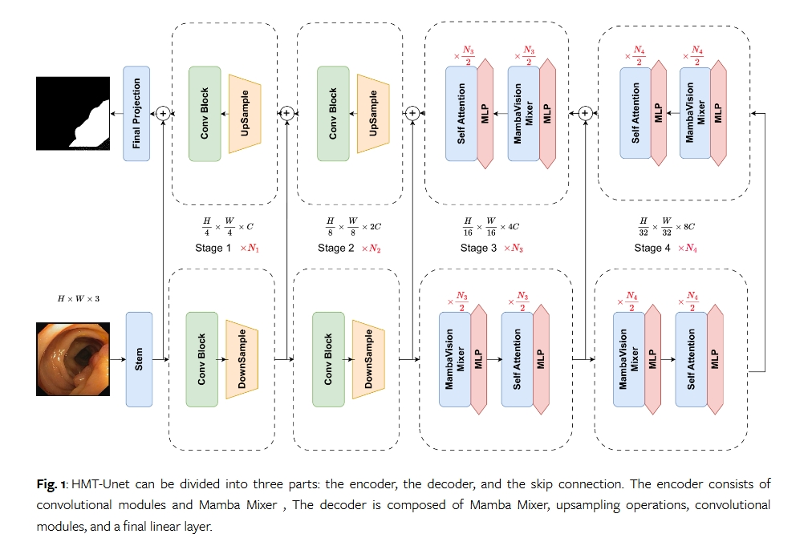

# HMT-Unet

This is the official code repository for "HMT-UNet: A hybird Mamba-Transformer Vision UNet for Medical Image Segmentation". 

## training details

Our training code can refer to the VM-UnetV2 repository{[git link](https://github.com/nobodyplayer1/VM-UNetV2)}, please replace the files with those from this model.

